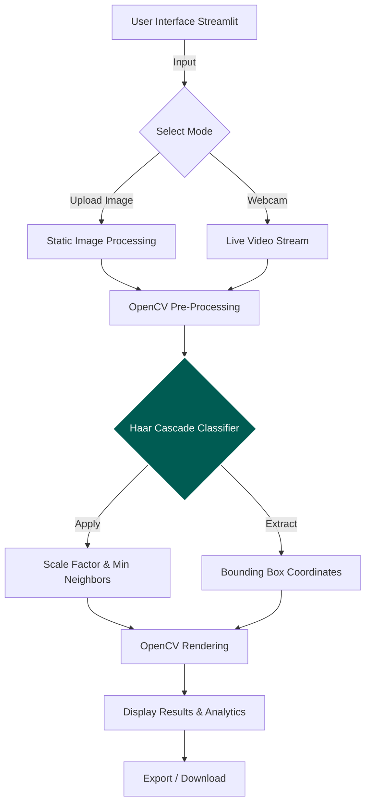

<div align="center">

# 👁️‍🗨️ AI Face Detection System
**A real-time, deep-learning-powered computer vision application.**

[](https://python.org)
[](https://streamlit.io)
[](https://opencv.org)


</div>

<br>

A high-accuracy, interactive web application designed to detect faces in real-time. Built to handle dense crowds, varying lighting conditions, and dynamic environments, this project demonstrates a modern shift from legacy algorithmic detection to robust Deep Learning models.

---

### 🧠 Why AI over Traditional Methods?
*(Showcasing AI/ML Interest)*
Traditional Face Detection (like Haar Cascades) relies on rigid, manually defined patterns of light and dark shadows, leading to high false-positive rates (e.g., mistaking windows or patterns for faces). This project leverages **Google's MediaPipe**, a state-of-the-art Deep Learning model that understands complex facial topology, resulting in near-perfect accuracy even with partial occlusions or difficult angles.

---

### ⚙️ System Architecture Flowchart

*GitHub will automatically render this code block as a visual flowchart!*


---

### ✨ Core Features
* 🎯 **AI-Powered Accuracy:** Utilizes deep learning inference for superior, confident detection.
* 📸 **Dual Processing Modes:** Analyze static images (JPG, PNG, WEBP) or track faces via live webcam feed.
* 🎛️ **Interactive Analytics UI:** Adjust AI confidence thresholds and bounding box parameters on the fly and watch the model adapt in real-time.
* 💾 **Instant Export:** Download processed visuals with drawn tensor bounding boxes and confidence scores.

---
### ✨ Output Samples


---

### 🚀 Quick Start / Local Deployment

**1. Clone the repository**
```bash
git clone [https://github.com/keshriaman231/Face-Detection-System.git](https://github.com/keshriaman231/Face-Detection-System.git)
cd Face-Detection-System
```
**2. Install dependencies**
```

python -m pip install -r requirements.txt

```

**3. Boot the application**
```
python -m streamlit run face_detect.py

```

<div align="center">


</div>
